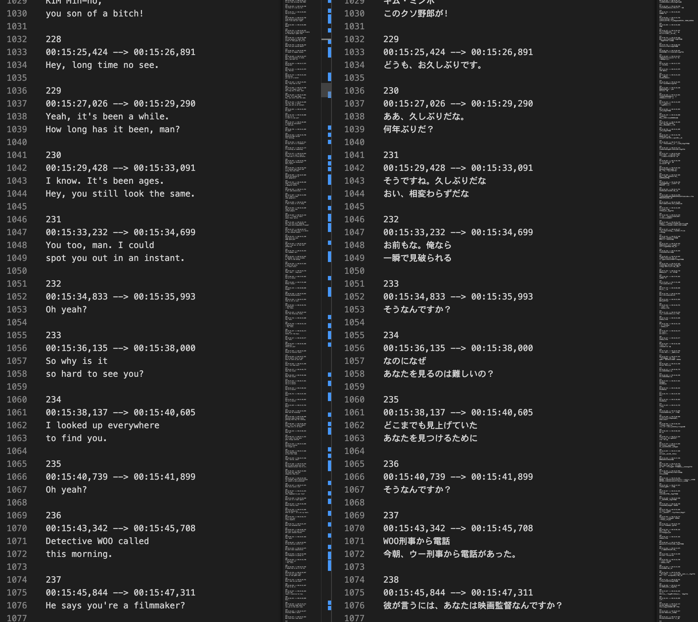

# tranSRTe



This script translates srt files into other languages.
Translation uses [DeepL API](https://www.deepl.com/ja/docs-api), so you need to prepare an authentication key in advance.

## Install

```
git clone https://github.com/shuheilocale/tranSRTe.git
pip install -r requirements.txt
```

## How to Use

```
python transrte/api.py \
  -i path_to_src_srt_file \
  -o path_to_dst_srt_file \
  -a deepl_auth_key
```